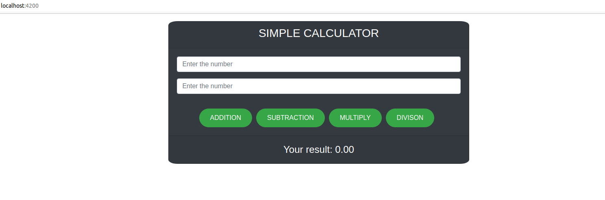
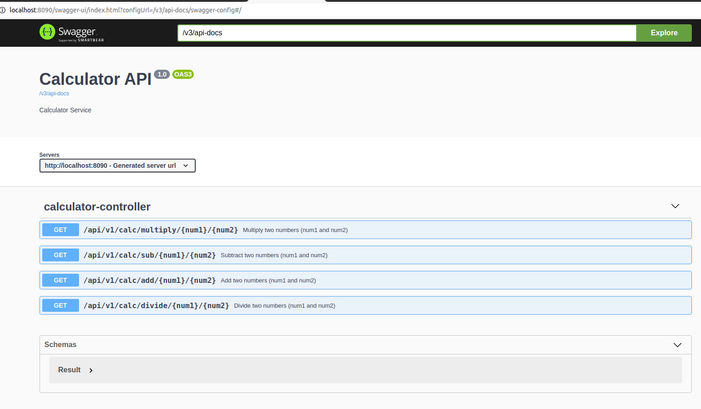

# simple-calculator
This project has feature to add, subtract, multiply and divide two numbers

# calculator-frontend

This is the frontend application where user can enter to add, subtract, multiply and divide two numbers.

[https://github.com/techragesh/simple-calculator/tree/master/calculator-frontend](https://github.com/techragesh/simple-calculator/tree/master/calculator-frontend)

# calculator-api

This is the backend rest api where the functioanlity of the calculation resides.

[https://github.com/techragesh/simple-calculator/tree/master/calculator-api](https://github.com/techragesh/simple-calculator/tree/master/calculator-api)

# screenshots

# Happy Coding

