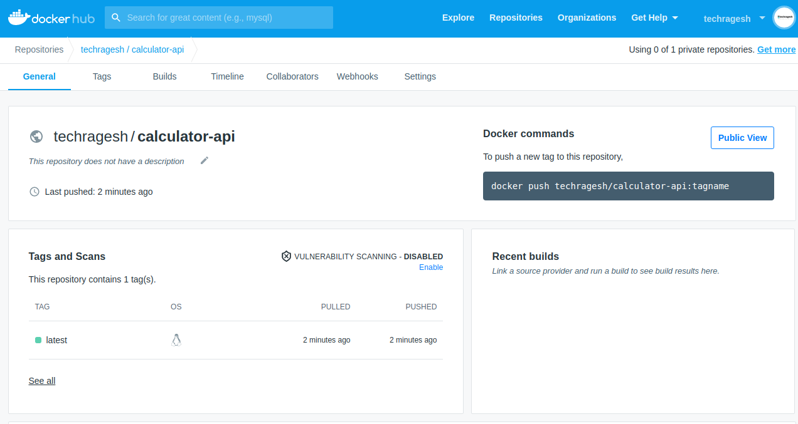
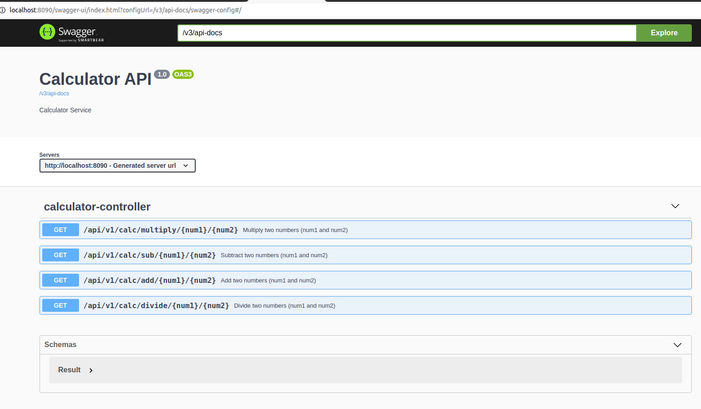
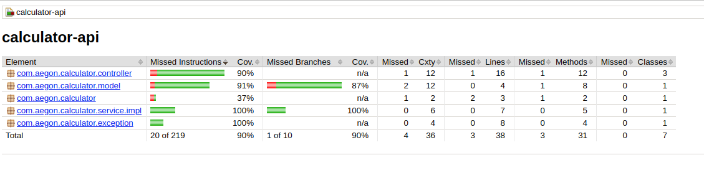

# CALCULATOR API
This calculator api has features to add, subtract, multiply and delete the two numbers

## Requirement

The result of this assessment is to have a calculator backend that can perform calculations
and calculations based on a list of input objects. It should have a web-based frontend. E.g. a
form in which you can enter the calculations and display the result is sufficient.
Create a "SimpleCalculator" Java class that will have the following operations:
- public double add(int, int)
- public double subtract(int, int)
- public double multiply(int, int)
- public double divide(int, int)


### Installation & Execution Steps

**Prerequisties**
* Java 11
* Maven 3.6.3

**Dependencies**
* Spring boot 2.4.0 - Spring Framework
* Open API 1.3.0  - REST API Documentation (Swagger)
* lombok 1.18.16 - Java Library
* Jacoco Plugin 0.8.3 - Unit Test Coverage Plugin

### Execution

1. **Checkout the source code**
    ```
      git clone https://github.com/techragesh/calculator-api
      cd calculator-api
    ```

2. **Build the application**
    ```
    mvn clean install
    ```

3. **Run the application**
    ```
    mvn spring-boot:run
    ```
4. **Build Docker Image**
   ```
   mvn compile jib:build
   ```

### Run application through Docker Image

```
docker pull techragesh/calculator-api

docker run -p 8090:8090 techragesh/calculator-api:latest

```

### REST API Docuumentation

After running the application and browse the swagger api url

Open API Docs:

[http://localhost:8090/v3/api-docs](http://localhost:8090/v3/api-docs)

Swagger API URL:

[http://localhost:8090/swagger-ui/index.html?configUrl=/v3/api-docs/swagger-config](http://localhost:8090/swagger-ui/index.html?configUrl=/v3/api-docs/swagger-config)

### Screenshots







### Happy Coding