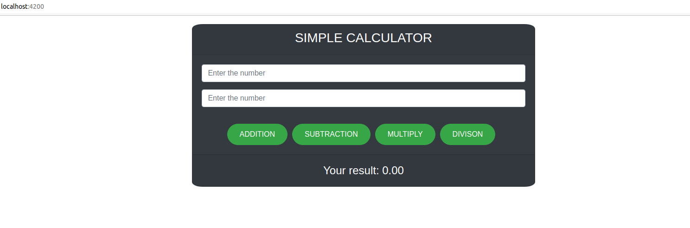

# Calculator Frontend

This project was generated with [Angular CLI](https://github.com/angular/angular-cli) version 11.0.4.

This application has feature to add, subtract, multiply and divide the two given numbers

## Development server

Run `ng serve` for a dev server. Navigate to `http://localhost:4200/`. The app will automatically reload if you change any of the source files.

## Calculator - API Service

This application invoke calculator api service to calculate the two numbers.

calculator api service url is

```
http://localhost:8090/api/v1/calc

```

## Screenshot


